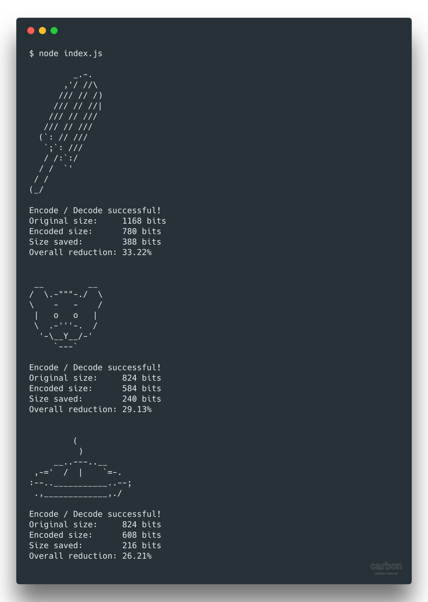

# ascii-transport

```
         _.-.
       ,'/ //\
      /// // /)
     /// // //|
    /// // ///
   /// // ///
  (\`: // ///
   \`;\`: ///
   / /:\`:/
  / /  \`'
 / /
(_/
```

The goal of this challenge is to take a piece of ASCII artwork and
devise a compression algorithm that will allow for efficient network
transport and storage. The challenge allotted 60 minutes for planning
and implementation, but sadly this solution took around 75 since my
dog just **had** to go outside as soon as I started.

This is a great challenge and I highly recommend you try to implement
it yourself before looking at the method I used.

My benchmarked results are shown below:


